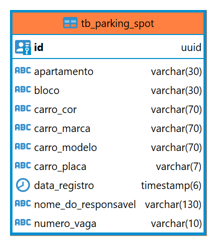
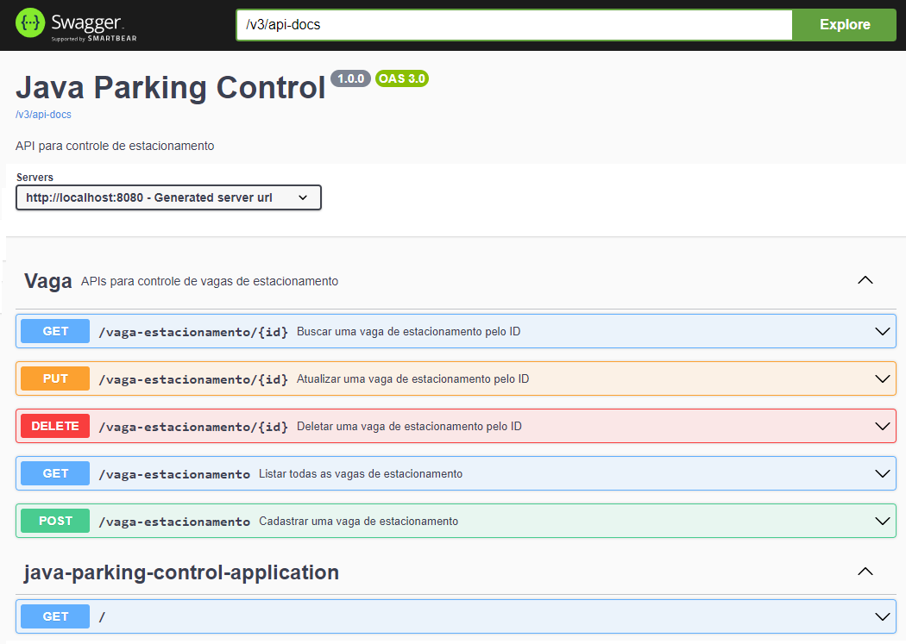

<div align="center">

   <h1> Java - Parking Control 🚗</h1>

</div>


Este é um projeto simples de controle de estacionamento em uma API RESTFull.

---

<div align="center">
  <h2>🧰 Tecnologias, linguagens e ferramentas utilizadas:</h2>
  <p align="center">
    <a href="https://github.com/PFonsecaFV/PFonsecaFV">
    
    
    
    
    
    
    
    
    
    </a>
  </p>
</div>


<div align="center">
    <table border="1">
        <tr>
            <th colspan="2">CONFIGURAÇÃO DA API</th>
        </tr>
        <tr>
            <th>Projeto:</th>
            <td>Maven</td>
        </tr>
        <tr>
            <th>Linguagem:</th>
            <td>Java 17</td>
        </tr>
        <tr>
            <th>Framework:</th>
            <td>Spring Boot 3.1.3</td>
        </tr>
        <tr>
            <th>Arquitetura:</th>
            <td>MSC (Model-Service-Controller)</td>
        </tr>
        <tr>
            <th rowspan="5">Dependências:</th>
            <td>Spring Web</td>
        </tr>
        <tr>
            <td>Spring Data JPA</td>
        </tr>
        <tr>
            <td>Spring Validation</td>
        </tr>
        <tr>
            <td>SpringDoc OpenAPI</td>
        </tr>
        <tr>
            <td>PostgreSQL Driver</td>
        </tr>
        <tr>
            <th rowspan="2">Banco de Dados:</th>
            <td>PostgreSQL</td>
        </tr>
        <tr>
            <td>Docker</td>
        </tr>
    </table>
</div>

- Spring Validation para criação de API com suporte a Pageable
- Global Custom Date Time Format
- Diagrama ER do banco de dados

<br>
<div align="center">
   
</div>

## <strong>🎯O que foi desenvolvido</strong><br />

O projeto implementa um sistema de controle de estacionamento com as seguintes funcionalidades:

- Cadastro, leitura, atualização e exclusão de veículos estacionados.
- Integração com banco de dados PostgreSQL para armazenamento persistente dos dados.
- API RESTful com suporte a paginação (Pageable) para consultas.

## 📝Orientações para instalar e testar o projeto

Para executar o projeto, certifique-se de ter o Docker instalado em sua máquina. Siga os passos abaixo:

1. Crie um diretório usando o comando mkdir e entre no diretório:
   ```bash
   mkdir patrick-fonseca-projetos-java && cd patrick-fonseca-projetos-java
   ```
2. Clone o repositório e use o comando no terminal:
   ```bash
   git clone git@github.com:PFonsecaFV/java-parking-control.git
   ```
3. Acesse o diretório do projeto e instale suas dependências:
   ```bash
   cd java-parking-control
   ```

4. Utilize o Docker para executar o banco de dados PostgreSQL:


5. Para testar as requisições no Swagger entre no link abaixo:
   ```html
   http://localhost:porta/swagger-ui/index.html#/
    ```
   - Substitua `localhost` e `porta` pelos valores adequados, dependendo de como você configurou a API.
   - A documentação do Swagger fornecerá informações detalhadas sobre os endpoints da API, parâmetros, exemplos de solicitações e respostas, e muito mais.


## ✅ Testes de Requisições e Documentação do Swagger

Na pasta `client_requests` você encontra um arquivo que pode ser importado a um <strong>Client REST</strong> para testar as requisições.
<br>
<br>
Este arquivo vem com exemplos de requisições já preenchidas para se testar.
<br>
<br>
1. Requisições do tipo `POST`


2. Requisições do tipo `GET`


3. Requisições do tipo `DELETE`


4. Requisições do tipo `PUT`


5. Requisições do tipo `GET PAGEABLE`

<br>
<div align="center">
   
</div>
<br>

<details>
   <summary><b>Exemplo de entrada para cadastro de vaga</b></summary>

   ```json
   {
      "numeroVaga": "205B",
      "carroPlaca": "FUS1975",
      "carroMarca": "Volkswagen",
      "carroModelo": "Fusca 1300",
      "carroCor": "Preto",
      "nomeDoResponsavel": "Patrick Fonseca",
      "apartamento": "205",
      "bloco": "B"
   }
   ```
      
   </details>

<details>
   <summary><b>Alguns exemplos caso queira testar</b></summary>

   ```json
	{
		"numeroVaga": "205B",
		"carroPlaca": "FUS1975",
		"carroMarca": "Volkswagen",
		"carroModelo": "Fusca 1300",
		"carroCor": "Preto",
		"nomeDoResponsavel": "Patrick Fonseca",
		"apartamento": "205",
		"bloco": "B"
	}
		
	{
		"numeroVaga": "160A",
		"carroPlaca": "VER1991",
		"carroMarca": "Chevrolet",
		"carroModelo": "Veraneio",
		"carroCor": "Marrom",
		"nomeDoResponsavel": "José Fonseca",
		"apartamento": "137",
		"bloco": "B"
	}
		
	{
		"numeroVaga": "200A",
		"carroPlaca": "MAV1976",
		"carroMarca": "Ford",
		"carroModelo": "Maverick",
		"carroCor": "Amarelo",
		"nomeDoResponsavel": "Anderson Fonseca",
		"apartamento": "200",
		"bloco": "A"
	}
		
	{
		"numeroVaga": "170A",
		"carroPlaca": "CAM2000",
		"carroMarca": "Chevrolet",
		"carroModelo": "Camaro",
		"carroCor": "Amarelo",
		"nomeDoResponsavel": "Vinícios Fonseca",
		"apartamento": "120",
		"bloco": "A"
	}
		
	{
		"numeroVaga": "150A",
		"carroPlaca": "VER1989",
		"carroMarca": "Chevrolet",
		"carroModelo": "Veraneio",
		"carroCor": "Azul",
		"nomeDoResponsavel": "Fonseca Anderson",
		"apartamento": "180",
		"bloco": "A"
	}
		
	{ 
		"numeroVaga": "150B",
		"carroPlaca": "OPA1978",
		"carroMarca": "Chevrolet",
		"carroModelo": "Opala",
		"carroCor": "Cinza",
		"nomeDoResponsavel": "Patrick Anderson",
		"apartamento": "150",
		"bloco": "B"
	}
   ```

   </details>

<br>

---

<div align="center">
  <h2>Patrick Fonseca</h2>
	  <a href="https://www.linkedin.com/in/PatrickFonseca/" target="_blank">
      
    </a>
</div>
